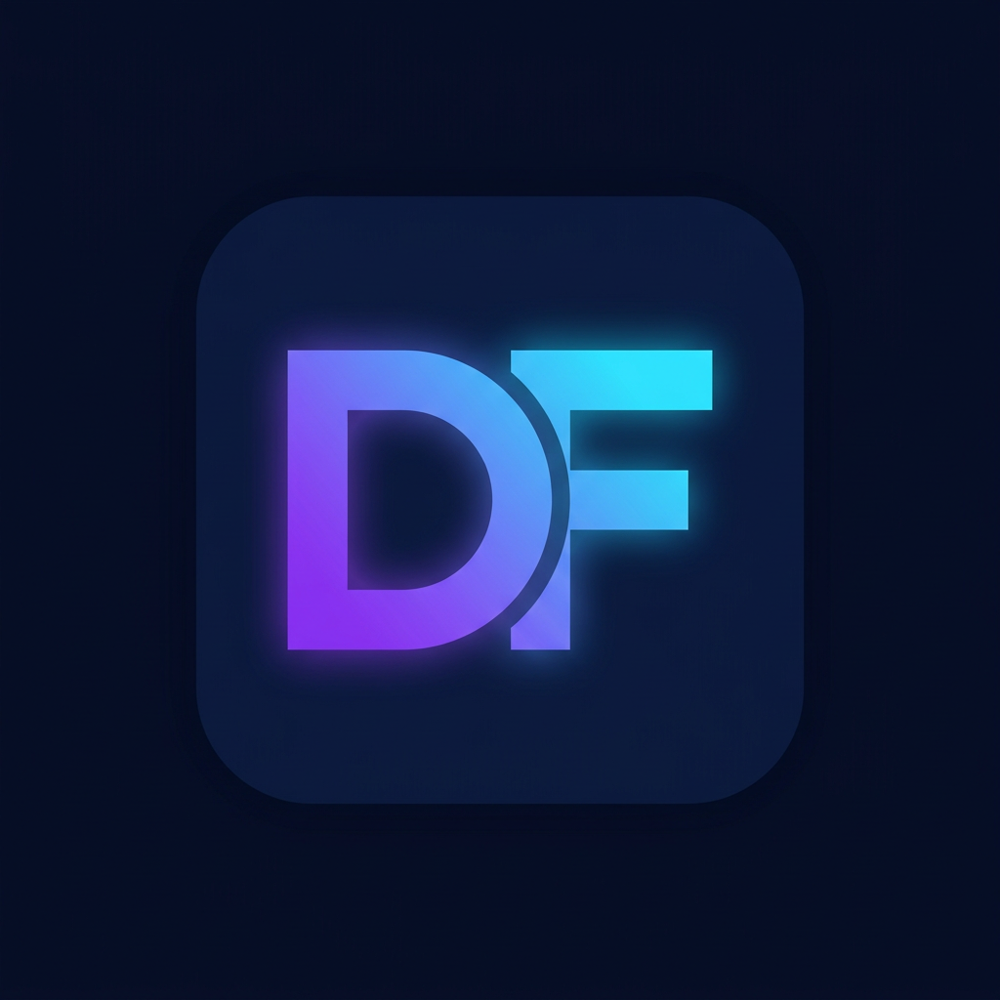

<p align="center">
  
</p>

<h1 align="center">🤖 DF VPN Bot</h1>

> **Автор: [@Dolov07KBR](https://github.com/Dolov07KBR)** · сайт: [dolov07kbr.github.io](https://dolov07kbr.github.io)

Полноценный Telegram-бот для продажи VPN-подписок на **aiogram 3**: витрина тарифов, оплата (карты РФ/СБП через ЮKassa, Telegram Stars, внутренний баланс), автоматическая выдача ключей из пула или из панели **3x-ui / Marzban**, реферальная программа, промокоды, поддержка, напоминания и админ-панель прямо в Telegram.

> Ранее бот жил в репозитории [DF_IPTV](https://github.com/Dolov07KBR/DF_IPTV) вместе с m3u-плейлистами. Плейлисты остались там, бот переехал сюда и полностью переписан с нуля на aiogram 3.

---

## ⚡️ Установка на VPS одной командой

```bash
bash <(curl -fsSL https://raw.githubusercontent.com/Dolov07KBR/DF-VPN-Bot/main/install.sh)
```

Установщик спросит токен бота, ваш Telegram ID, способы оплаты и режим выдачи ключей, затем поставит зависимости, создаст `.env`, заведёт systemd-службу `dfvpnbot` и запустит бота с автозапуском.

Полезные режимы:

```bash
sudo bash install.sh --update      # обновить код и перезапустить
sudo bash install.sh --uninstall   # удалить службу (база и .env останутся)
sudo bash install.sh --yes         # без вопросов, значения из переменных окружения
sudo bash install.sh --dir /srv/dfvpnbot --no-service   # свой каталог, без systemd
```

Управление после установки:

```bash
systemctl status dfvpnbot
journalctl -u dfvpnbot -f     # живые логи
systemctl restart dfvpnbot
```

## 🐳 Установка через Docker

```bash
git clone https://github.com/Dolov07KBR/DF-VPN-Bot.git && cd DF-VPN-Bot
cp .env.example .env && nano .env      # заполните BOT_TOKEN, ADMIN_IDS и остальное
docker compose up -d --build
docker compose logs -f
```

## 🛠 Ручная установка

```bash
git clone https://github.com/Dolov07KBR/DF-VPN-Bot.git && cd DF-VPN-Bot
python3 -m venv .venv && .venv/bin/pip install -r requirements.txt
cp .env.example .env && nano .env       # токен, админы, оплата, панель
.venv/bin/python bot.py
```

Проверить, что всё собрано корректно, можно без Telegram:

```bash
.venv/bin/python tools/selftest.py          # 40 проверок логики
.venv/bin/python tools/integration_test.py  # прогон апдейтов через диспетчер
```

---

## ✨ Возможности

### Для клиентов
| Функция | Описание |
|---|---|
| 🛒 Витрина тарифов | Цены, сроки, лимиты трафика и устройств — редактируются из админки без перезапуска |
| 💳 Оплата | Карта РФ / СБП (ЮKassa), Telegram Stars, оплата с внутреннего баланса, ручное подтверждение |
| 🎟 Промокоды | Процент или фиксированная сумма, лимит активаций и срок действия |
| 🎁 Пробный период | Бесплатный доступ на N дней один раз на пользователя |
| 🔑 Мои ключи | Карточка подписки, ссылка-конфиг, подписка, **QR-код**, инструкция под конкретное приложение |
| 🔄 Продление в один тап | Конфиг остаётся тем же, срок сдвигается (в 3x-ui/Marzban продление применяется в панели) |
| ⏰ Напоминания | За 3 дня и за 1 день до окончания, с кнопкой «Продлить» |
| 💰 Баланс | Пополнение картой/звёздами, оплата подписки с баланса, бонусы |
| 🤝 Реферальная программа | Ссылка-приглашение, процент с покупок приглашённых на баланс, статистика по приглашённым |
| 🆘 Поддержка | Встроенные тикеты: пользователь пишет в боте, админ отвечает из админки |
| 📲 Инструкции и FAQ | Готовые подсказки под v2rayNG, Streisand, Shadowrocket, Hiddify, NekoBox/NekoRay |
| 📄 Документы | `/terms` и `/privacy` (тексты можно заменить своими через `.env`) |

### Для администратора (всё в Telegram, команда `/admin`)
- **📊 Статистика** — пользователи за сутки/неделю, активные подписки, выручка за день/30 дней/всё время, пополнения, топ рефералов.
- **💰 Заказы** — список ожидающих, ручное подтверждение оплаты в один тап (для переводов и крипты).
- **🔑 Ключи** — загрузка ключей в пул пачкой, список пула, очистка использованных, проверка подключения к панели.
- **👥 Пользователи** — поиск по ID/@username/номеру заказа, карточка (баланс, подписки, заказы), сообщение от админа, правка баланса, выдача подписки, блокировка, отзыв устройств.
- **🎟 Промокоды** — создание, включение/выключение, удаление, статистика активаций.
- **📢 Рассылка** — всем / только с активной подпиской / только без подписки, с отчётом о доставке.
- **🧾 Тикеты** — открытые обращения, ответ и закрытие прямо из чата с ботом.
- **🎛 Настройки** — тарифы (цена, срок, трафик, устройства, скрыть/показать), дни пробного периода, реферальный процент.
- **💾 Бэкап** — бот присылает файл базы данных админу.
- **🚀 Старт-уведомление** — админам приходит сообщение о запуске с версией, панелью и способами оплаты.

### Технические фишки
- long-polling (не нужен домен) — или вебхуки ЮKassa отдельным HTTP-сервером, если есть публичный адрес;
- **проверка платежа по API** (телу вебхука не доверяем — сверяем сумму и статус);
- резервный опрос ЮKassa раз в 3 минуты, если вебхуки выключены;
- фоновая обработка: истечение подписок (с отключением клиента в панели), напоминания, автоотмена «висящих» заказов;
- анти-спам троттлинг и обязательная подписка на каналы (проверка `getChatMember`);
- реферальные начисления, лог платежей, логи с ротацией;
- автоматическая проверка конфигурации на старте — понятные сообщения об ошибках.

---

## 🔑 Выдача ключей: три режима

Переключается переменной `VPN_PANEL` в `.env`.

| Режим | Что делает | Когда подходит |
|---|---|---|
| `pool` | Берёт готовый конфиг из пула (ключи загружаются в админке) | Продажа готовых конфигов, ручные серверы |
| `xui` | Создаёт клиента через API **3x-ui**, собирает ссылку (`vless/vmess/trojan`, reality/ws/tls/grpc) | Свой сервер на 3x-ui |
| `marzban` | Создаёт пользователя в **Marzban**, отдаёт ссылку подписки и конфиги | Свой сервер на Marzban |

Подробная настройка панелей: **[docs/SETUP-PANELS.md](docs/SETUP-PANELS.md)**.

## 💳 Оплата: что включить

| Способ | Что нужно | Подробно |
|---|---|---|
| `yookassa` | `YOOKASSA_SHOP_ID` + `YOOKASSA_SECRET_KEY`, при желании вебхук | [docs/SETUP-PAYMENTS.md](docs/SETUP-PAYMENTS.md) |
| `stars` | Ничего — работает сразу; `STARS_RATE` задаёт курс ₽→⭐️ | там же |
| `balance` | Ничего — пополнение картой/звёздами, оплата с баланса | — |
| `manual` | Только текст `MANUAL_PAYMENT_NOTE`; админ подтверждает оплату кнопкой | — |

Список активных способов — переменная `PAYMENT_METHODS=yookassa,stars,balance,manual`.

---

## ⚙️ Основные настройки `.env`

Полный список с комментариями — в [.env.example](.env.example). Самое важное:

| Переменная | Назначение |
|---|---|
| `BOT_TOKEN` | Токен от [@BotFather](https://t.me/BotFather) |
| `ADMIN_IDS` | Telegram ID админов через запятую ([@userinfobot](https://t.me/userinfobot)) |
| `VPN_PANEL` | `pool` / `xui` / `marzban` |
| `PAYMENT_METHODS` | `yookassa,stars,balance,manual` |
| `TRIAL_ENABLED`, `TRIAL_DAYS` | Пробный период |
| `REF_PERCENT` | Процент реферальных начислений (0–50) |
| `REQUIRED_CHANNELS` | `@ch1,@ch2` — обязательная подписка (бот должен быть админом канала) |
| `WEBHOOK_ENABLED`, `WEBHOOK_PUBLIC_URL` | Приём уведомлений ЮKassa (нужен публичный HTTPS) |
| `NOTIFY_DAYS_BEFORE` | За сколько дней напоминать: по умолчанию `3,1` |
| `AUTO_DISABLE_EXPIRED` | Отключать клиента в панели при истечении подписки |

Тарифы, пробный период и реферальный процент можно менять прямо в админке (значения из админки приоритетнее `.env` для пробного периода и реф-процента).

## 🧭 Команды бота

**Пользователю:** `/start` · `/menu` · `/help` · `/terms` · `/privacy`
**Админу:** `/admin` · `/stats`

## 🗂 Структура проекта

```
bot.py                     точка входа: конфиг, диспетчер, polling, фоновые задачи
app/config.py              чтение и валидация .env
app/db.py                  SQLite: пользователи, заказы, подписки, пул, промо, тикеты
app/runtime.py             настройки, изменяемые из админки на лету
app/keyboards.py           все клавиатуры
app/middlewares.py         троттлинг, регистрация, обязательная подписка, ошибки
app/utils.py               форматирование, QR-коды, инструкции
app/handlers/user.py       магазин, оплата, ключи, профиль, рефералы, поддержка
app/handlers/admin.py      админ-панель
app/services/panels.py     pool / 3x-ui / Marzban
app/services/payments.py   ЮKassa API, Telegram Stars
app/services/subs.py       выдача, продление, истечение, напоминания, бонусы
app/webhook.py             HTTP-сервер уведомлений ЮKassa
tools/selftest.py          автотест логики без сети
tools/integration_test.py  тест маршрутизации апдейтов через диспетчер
install.sh                 установщик на VPS одной командой
deploy/dfvpnbot.service    образец systemd-юнита
docs/                      инструкции по панелям и оплате
```

## 🧯 Частые вопросы

**Нужен ли домен?** Нет. Бот работает на long-polling; домен нужен только для мгновенных вебхуков ЮKassa. Без них бот сам проверяет оплату каждые 3 минуты, а пользователь может нажать «🔄 Проверить оплату».

**«Пул ключей пуст».** Откройте `/admin` → 🔑 Ключи → ➕ Добавить ключи и вставьте конфиги (по одному в строке) — либо переключитесь на панель `xui`/`marzban`.

**Как обновить бота?** `sudo bash install.sh --update` (код скачается заново, `.env` и база сохранятся) или `git pull && systemctl restart dfvpnbot`.

**Как забэкапить базу?** `/admin` → 💾 Бэкап базы — бот пришлёт файл SQLite. Данные и логи лежат в `data/`.

**ЮKassa: пишет, что платёж не подтверждён.** Проверьте, что `YOOKASSA_SHOP_ID`/`SECRET_KEY` из одного магазина, а в кабинете ЮKassa указан тот же адрес уведомлений, что в `WEBHOOK_PUBLIC_URL`.

**Можно ли подключить свою панель?** Да: добавьте класс-наследник `BasePanel` в `app/services/panels.py` с методами `create_client/extend_client/set_enabled/delete_client` и зарегистрируйте его в `get_panel()`.

## 👤 Автор

**[@Dolov07KBR](https://github.com/Dolov07KBR)** — разработка, дизайн и поддержка проекта.

- Репозиторий бота: [Dolov07KBR/DF-VPN-Bot](https://github.com/Dolov07KBR/DF-VPN-Bot)
- Плейлисты IPTV: [Dolov07KBR/DF_IPTV](https://github.com/Dolov07KBR/DF_IPTV)
- Вопросы и предложения: через поддержку бота или [issues на GitHub](https://github.com/Dolov07KBR/DF-VPN-Bot/issues)

## ⚠️ Дисклеймер

Проект предоставляется «как есть» для легального использования (личный VPN, корпоративный доступ к своим ресурсам). Перед продакшеном настройте оферту, политику конфиденциальности и налоговый учёт в вашей юрисдикции. Автор не несёт ответственности за использование сервиса третьими лицами.

## 📄 Лицензия

MIT — см. [LICENSE](LICENSE).
